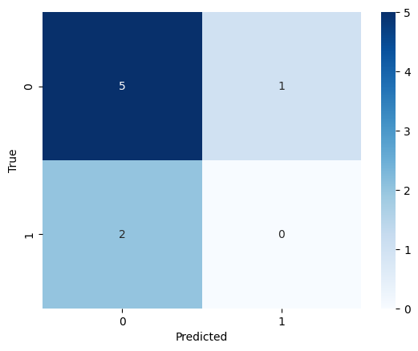
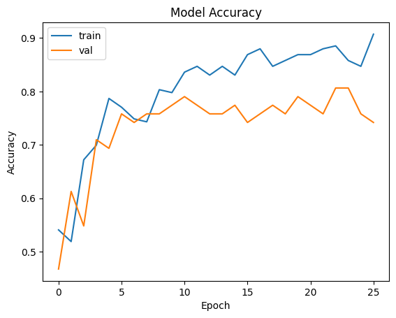
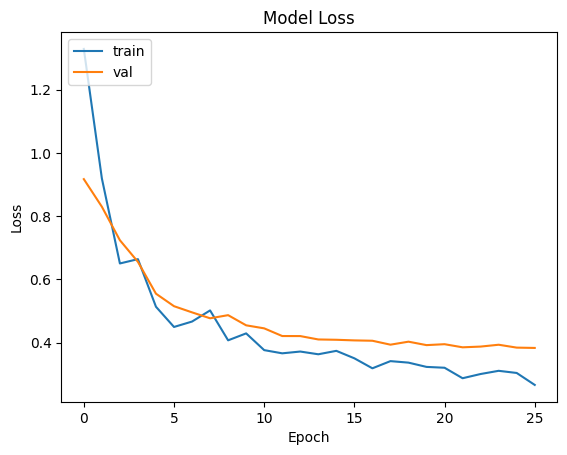

# CodeClauseInternship_Brain_Tumor_Detection

This project focuses on the detection of brain tumors using deep learning techniques. It involves training a binary classification model to classify brain MRI images into two classes: 'Tumor' and 'No Tumor'.

## Table of Contents

- [Overview](#overview)
- [Dataset](#dataset)
- [Installation](#installation)
- [Usage](#usage)
- [Results](#results)
- [License](#license)

## Overview

This project utilizes the VGG19 architecture, a popular convolutional neural network (CNN) model, to classify brain MRI images as containing tumors or not. The project includes data preprocessing, model creation, training, and evaluation.

## Dataset

The dataset used in this project consists of brain MRI images, which are divided into two classes:
- 'Yes': Images containing brain tumors.
- 'No': Images without brain tumors.

The dataset is split into training, validation, and test sets to train and evaluate the model.

## Installation

1. Clone the repository:

    ```bash
    git clone https://github.com/akshitaadhikari/CodeClauseInternship_Brain_Tumor_Detection.git
    cd CodeClauseInternship_Brain_Tumor_Detection

2. Install the required libraries using pip
   
    ```bash
    pip install -r requirements.txt

## Usage

1. Run the Jupyter Notebook or Python script to train the brain tumor detection model.

2. The code includes data preprocessing, model creation, training, and evaluation steps.

3. The trained model will be saved, and you can use it to make predictions on new brain MRI images.

## Results

- The model's performance is evaluated using accuracy and the confusion matrix.
- Training and validation curves are plotted to visualize the model's learning progress.

### Example Results

#### Confusion Matrix



#### Training and Validation Curves




## License

This project is licensed under the MIT License - see the [LICENSE](LICENSE) file for details.
